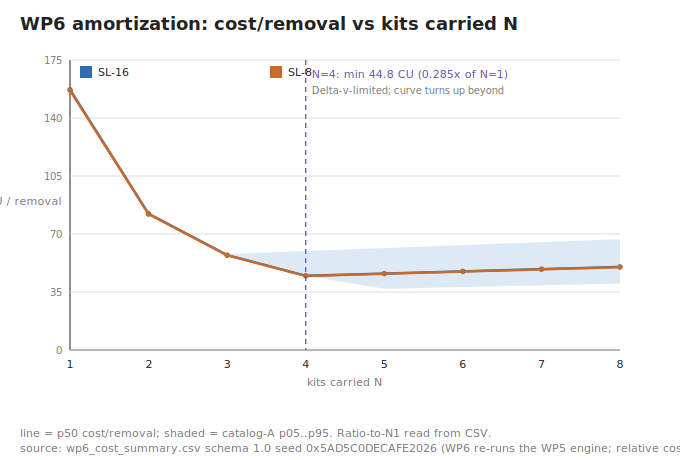
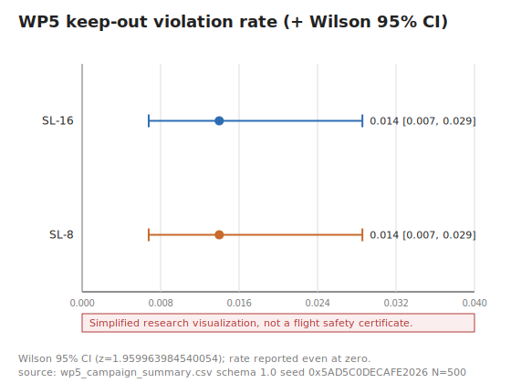
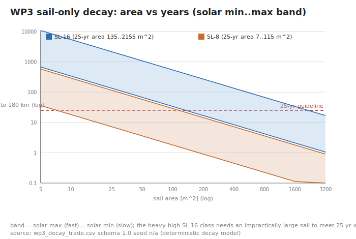
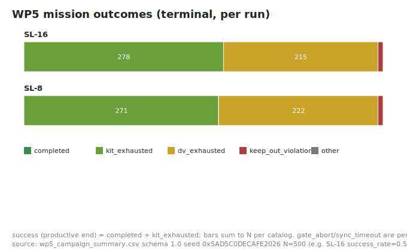
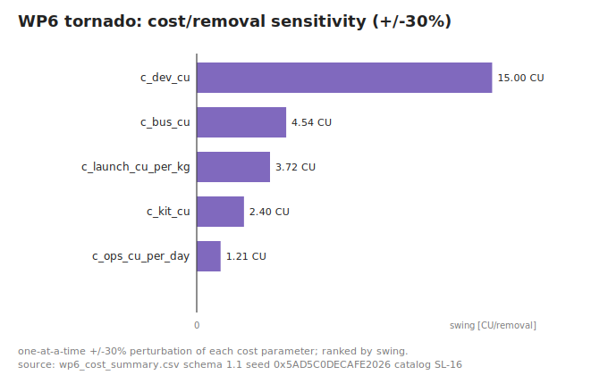
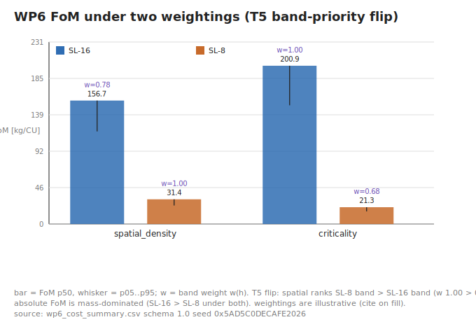

# ADSC Evidence Pack

**An open, reproducible evidence package for installer-type active debris
remediation (Kessler-precursor removal).** Audience: skeptical mission-design
engineers at the agencies and contractors of major launching states. Claim
discipline: every number in this document is read mechanically from a
committed, regenerable artifact (no hand-written figures); every figure is a
committed SVG; one script regenerates everything (section 9). This is a
numerical-simulation evidence package - NOT flight software, NOT a mission
proposal, and nothing here is a legal determination. This is not legal
advice. Maturity claim: TRL 4 for the GNC software element only,
element-scoped; system-level TRL is undefined and not claimed.

## 1. Executive summary

ADSC argues one thing quantitatively: **a small installer servicer that
attaches passive deorbit kits to massive derelict upper stages, several per
mission in one plane, is the highest-leverage, lowest-cost intervention
against the debris-cascade source term - and the argument survives honest
negative results.** The two headline artifacts:

**Batch amortization (WP6, relative cost units):** carrying N kits drives
cost/removal down to **0.285 x the single-target baseline at N=4**
(44.80 CU vs 157.07 CU p50), where the Delta-v budget - not the kit count - caps
removals; beyond that, extra kits add cost without removals and the curve
turns back up. That shape is the installer argument in one figure:



**Debris-risk reduction per cost (FoM = sum m_i * w(h_i) / C_campaign, p50
kg/CU at N=4, under two congestion weightings - both PLACEHOLDER tables):**

| catalog class | spatial-density weighting | criticality weighting |
|---|---:|---:|
| SL-16 (~9 t) | 156.7 | 200.9 |
| SL-8 | 31.4 | 21.3 |

The heavy class dominates under BOTH weightings (FoM is mass-dominated),
while the weightings disagree about band priority - an honest metric-choice
disagreement kept open as trade T5 (section 5). Campaign robustness under
dispersions (N=500 runs/catalog, fixed seed 0x5AD5C0DECAFE2026): success (productive end)
0.556 [0.512, 0.599] (Wilson 95%) for the SL-16 class; keep-out violation rate 0.014 [0.007, 0.029] (Wilson 95%).

## 2. Architecture and the installer argument

**Why installer, not tug (locked decision D1).** Deorbit Delta-v scales with
the mass it must decelerate. A tug that grapples and tows a SL-16-class stage
must move roughly **304 x its own contact mass** (9000 kg target vs 29.6 kg
servicer-at-contact, from the committed catalog and mission data); the
installer instead transfers a 2.4 kg passive kit and departs, so the
propellant cost of the deorbit itself is carried by drag (sail) or
electrodynamic drag (tether), not by the servicer. One mission services
several targets in one plane (batch amortization, section 5); the capture
interface is a geometry-keyed clamp on features present on every upper
stage by construction (nozzle throat / adapter ring, D4), not a generic
manipulator.

**Cascade source-term framing (Kessler-precursor removal).** The collisional
cascade's fuel is the population of massive intact derelicts in congested
bands; fragments are the symptom. One intact-intact collision produces
thousands of trackable fragments, so removing (or equipping for removal)
the objects that would become the next fragment clouds attacks the source
term. Anchors in the open literature:

- Kessler, D. J., Cour-Palais, B. G., "Collision Frequency of Artificial
  Satellites: The Creation of a Debris Belt", Journal of Geophysical
  Research 83(A6), 1978 - the cascade mechanism itself.
- Liou, J.-C., Johnson, N. L., "Risks in Space from Orbiting Debris",
  Science 311(5759), 2006 - LEO population growth even without new
  launches (the instability argument).
- Liou, J.-C., Johnson, N. L., Hill, N. M., "Controlling the growth of
  future LEO debris populations with active debris removal", Acta
  Astronautica 66(5-6), 2010 - the classical few-removals-per-year
  (~5 objects/yr) environment-stabilization-class result that sizes the
  campaign cadence ADSC targets.
- External validation of the reference target class: the environmental-
  index peak near ~800-900 km / 70-80 deg inclination reported by the ESA
  Space Debris Office's Annual Space Environment Report matches catalog_A
  (~840 km / ~71 deg) [CITATION NEEDED - PLACEHOLDER: exact report issue /
  document ID to be confirmed at fill time].
- Population figures (>= 1 cm ~1.2 M objects) are MASTER-8-class model
  values [CITATION NEEDED - PLACEHOLDER: MASTER-8 release documentation
  reference], carried as PLACEHOLDER inputs in the T6 flux table.
- Catalog class parameters (mass/altitude/inclination for the SL-16 / SL-8
  classes) [CITATION NEEDED - PLACEHOLDER: public debris-ranking literature
  per spec D2].

The GNC element is textbook-level by design (D11): Clohessy-Wiltshire
relative motion, quaternion sliding-mode tracking, multiplicative EKF -
open-literature methods, class-level targets, no live ephemerides, no
target-specific operational products.

## 3. Safety case

All numbers below regenerate from `generated/reference_metrics.csv` and the
WP5 campaign CSVs.

- **Passive approach safety (D5/WP1):** across **120 thrust-off coasts**
  sampled along the approach corridor and propagated 2 orbital periods,
  the worst closest approach is **424.3 m**, comfortably outside the 200 m
  keep-out sphere. Scope honesty: this holds in the linear CW model
  (section 6).
- **Abort coverage including the capped case (F1):** the abort law is
  honest about its own limits. Clean case (contact range): impulse 0.245 m/s,
  full drift-null delivered, verified post-burn coast minimum 0.120 m.
  Capped case (large along-track drift): the commanded impulse saturates at
  the 2.0 m/s thruster budget, the bounded-orbit property is LOST, and the
  code reports the actual propagated coast minimum (3565.7 m) instead of
  implying safety.
- **Campaign-level keep-out exposure (WP5):** violation rate 0.014 [0.007, 0.029] (Wilson 95%) over 500
  dispersed missions (SL-16 class; the SL-8 class matches at the same seed
  discipline); abort-path exposure (runs with >= 1 closing-speed gate
  abort) 0.444 [0.401, 0.488] (Wilson 95%) - the 0.15 m/s gate is genuinely exercised, not decorative.



- **No-fragmentation-at-contact budget (D4/WP3):** clamping at the gated
  closing speed (0.15 m/s) with the 29.6 kg servicer-plus-kit carries
  **0.333 J** of kinetic energy - a contact-energy budget consistent with a
  geometry-keyed clamp on a decades-degraded surface without shedding MLI
  or paint (grabbing hard enough to shed flakes would manufacture the very
  debris the mission removes).
- **Estimate-driven, consistency-checked GNC (WP4):** the sync loop runs on
  estimates only (truth is structurally isolated to sensor models and error
  recording); under sensor noise the truth-evaluated criteria hold at
  **17.07 s** (truth-driven reference: 16.87 s), relative-attitude RMS 0.03 deg,
  and the NEES/NIS watchdog (translation NIS 3.944 vs dof 4) rejects the
  classic covariance-inflation fake. The v2 detumble regression (settle
  19.15 s) is retained as a pinned reference.

## 4. Deorbit-kit decay trades - the honest negatives first



- **SL-16 class (~9 t, ~840 km): sail-only does NOT close.** Meeting the
  IADC 25-year guideline needs **135..2155 m^2** of sail (solar max..min,
  from the committed trade CSV) - impractical at the upper end. Under a US
  FCC flight scenario the operative standard since 2022 is **5-year**
  post-mission disposal (FCC 22-74), which makes this negative strictly
  harder. This failure is a deliverable: it brackets open trade T1 and
  motivates the electrodynamic-tether branch.
- **SL-8 class (~1.4 t, ~750 km): sail-only closes** at **7..115 m^2** -
  tens of square meters, a practical kit.
- The EDT branch is carried as a parametric study axis only (deorbit time
  vs an along-track decay-rate knob), never a tether performance claim.
- Solar activity is always reported as a min..max RANGE (T4); the
  atmosphere model is the Vallado exponential profile (Vallado,
  "Fundamentals of Astrodynamics and Applications", 4th ed., Table 8-4),
  with a deliberately coarse altitude-independent solar factor marked
  PLACEHOLDER.

## 5. Campaign statistics and cost/FoM

WP5 Monte Carlo: 500 dispersed missions per catalog at fixed master seed
0x5AD5C0DECAFE2026, 6 targets-per-mission plan, 4 kits, 140 m/s Delta-v budget; all
dispersion magnitudes are PLACEHOLDER and centralized. Rates are quoted
with Wilson 95% intervals - never point estimates alone:

| metric (SL-16 class) | value |
|---|---|
| success (productive end) | 0.556 [0.512, 0.599] (Wilson 95%) |
| nonproductive termination | 0.444 [0.401, 0.488] (Wilson 95%) |
| gate-abort exposure | 0.444 [0.401, 0.488] (Wilson 95%) |
| keep-out violation | 0.014 [0.007, 0.029] (Wilson 95%) |
| removals per mission | p05 3 / p50 4 / p95 4 |
| Delta-v used [m/s] | p05 124 / p50 124 / p95 136 |
| sync arrival [s] | p05 14.47 / p50 17.68 / p95 20.09 |



Under the current flat PLACEHOLDER leg costs the nonproductive-termination
and gate-abort rates coincide numerically (every aborting mission also
exhausts its Delta-v); they are distinct concepts and separate columns.
The amortization curve (section 1) bottoms at N=4 because the **Delta-v
budget, not the kit count, caps removals** - the honest capacity story a
mission designer needs. Cost is RELATIVE (CU) throughout: **no absolute
cost is predicted anywhere in this package**; the CU-to-currency anchor is
a deliberately unfilled cited-range PLACEHOLDER. Parameter sensitivity is
ranked by a one-at-a-time tornado (development cost dominates):



**Open trade T5 (metric choice changes band priority):** under the
spatial-density weighting the lower band (SL-8) carries the higher band
weight; under the criticality-style weighting the higher band (SL-16) does.
Absolute per-catalog FoM stays mass-dominated under both, but the flip is
real and is kept visible rather than resolved by fiat:



## 6. Limitations - stated plainly, none hidden

- **Linear CW scope (F2):** every passive-safety statement is exact only in
  the linearized Clohessy-Wiltshire model - circular target orbit, no J2,
  no differential drag, small separations. J2 and differential drag erode
  drift-free safety ellipses over time; a real mission re-verifies every
  coast against a higher-fidelity propagator.
- **No plane-change/phasing optimization:** inter-target phasing is a flat
  parameterized Delta-v/time cost (PLACEHOLDER).
- **Campaign sensor dispersions are drawn but not re-propagated** through
  the closed loop (the WP4 estimate-driven acceptance carries the
  closed-loop sensor argument; the campaign reuses the truth-driven sync
  primitive for tractable N=500).
- **Sync-hold rests on the continuous-torque approximation:** the fine
  firing deadband that bounds the hold error assumes continuous torque; a
  real minimum-impulse-bit DACS would chatter or need reaction wheels.
- **Estimator scope:** known target inertia (a real mission needs inertia
  identification), Gaussian sensor abstractions (no outliers/dropouts/
  occlusions), sensor biases are knobs but not estimated, translation is
  estimated but not used for control (no closed-loop rendezvous guidance).
- **Small-debris (1-10 cm) removal is out of scope (T6) - by physics, not
  neglect:** at 10 km/s the specific kinetic energy is 50.0 MJ/kg (12.0x TNT-
  specific-energy ratio); a 1 cm Al fragment carries 70.7 kJ (16.9 g TNT
  equivalent); removing 1%/yr of the >= 1 cm population needs km^2-scale
  collection area that would itself be the largest collision cross-section
  in the band (full table: `generated/t6_flux_sweep.md`).
- **Jurisdiction coverage of the regulatory precheck is partial:** UN
  treaties + US agency rules + ITU/ESA references only; Russian, Chinese
  and Japanese national law - adopter targets - are NOT yet covered.
- **PLACEHOLDER discipline:** every unvalidated parameter in the repository
  is marked; the complete, mechanically-collected inventory is Appendix 10.

## 7. Regulatory precheck summary

**This is not legal advice.** The WP8 Compliance Matrix Generator is a
research-grade PRECHECK: it evaluates a declared mission profile against
versioned rulepacks (UN treaties, US FCC/FAA/NOAA, ITU and ESA references,
ADSC internal policy) and reports evidence gaps; it never determines legal
conformity. For the committed research profile:

- Summary: **PASS=6, INFO=2, WARN=1, BLOCK=0, UNKNOWN=0,
  NOT_APPLICABLE=9** - the research-only, class-level profile is not
  blocked merely for being an ADR concept; the one WARN is the honest
  export-control-review-not-started flag.
- The gate works in both directions: an ADR profile WITHOUT an affirmative
  owner-consent declaration is **BLOCKed** (OST Art. VIII precheck + ADSC
  policy, test-enforced), as is any live-ephemeris/target-specific-product
  profile (D11 guardrail).
- Framing (D9): the package assumes the operator is, or is contracted/
  consented by, the launching state of the target; consent in the research
  profile is a declared scenario assumption, never a legal fact. Dual-use
  guardrail (D11): open-literature methods, class-level targets, no live
  TLE ingestion, no operational approach products.
- Full matrix: `evidence/compliance_matrix.md` (rulepacks are versioned
  snapshots and can go stale; re-verify before any real-world use).

## 8. Flight-software migration path (annex - deliberately NOT implemented)

Adopters rewrite flight code; what they cannot cheaply reproduce is a
validated architecture trade. Spending effort there is the minimum-cost
allocation, so ADSC ships the trades and documents the migration path
instead of pretending at flight code:

- Hardware abstraction layer between GNC core and device drivers.
- Allocation-free control path (fixed-size Eigen types already; remove
  remaining dynamic allocation, ban exceptions on the control path).
- Fixed-rate scheduler with worst-case-execution-time instrumentation
  hooks.
- Mode machine (SAFE / HOLD / APPROACH / SYNC / ABORT) with FDIR hooks;
  the TMR fuel store and closing-speed/keep-out gates already prototype
  the FDIR style.
- Telemetry/command dictionary generated from the config structs.

Real-time processor-in-the-loop execution on representative hardware is
reserved as **WP9 - not started**; until then the maturity claim stays
TRL 4, element-scoped, and no flight-worthiness claim is made anywhere in
this package.

## 9. Reproduction instructions (clean machine -> every number)

```
git clone https://github.com/HeliCorgi/ADSC.git && cd ADSC
cmake -S . -B build -DCMAKE_BUILD_TYPE=Release   # + -DADSC_WERROR=ON for R3
cmake --build build
ctest --test-dir build                            # all suites
bash tools/regenerate_all.sh build                # regenerates generated/ + evidence/
git diff --exit-code -- generated/ evidence/      # byte-identical == reproduced
```

`tools/regenerate_all.sh` is the single source of truth for regeneration
order (campaign -> cost -> decay -> flux -> reference metrics -> figures ->
compliance -> this document); CI runs exactly this script and enforces the
byte-identity gate on every push. Measured wall time is printed to the CI
log (see the latest `build-and-test` run); it is intentionally never
embedded in artifacts, and it is well under the one-hour reproduction
budget (D10). Requirements: C++17 compiler, Eigen 3.3+, CMake, Python 3
standard library only.

## 10. Appendix - PLACEHOLDER inventory (mechanically collected)

Everything the package does NOT validate, in one honest list: every line
in `include/`, `src/` and `tools/` carrying the uppercase PLACEHOLDER mark
(R10), collected automatically by the generator of this document. If it is
listed here, treat the value as unvalidated until a cited source replaces
it.

Total marks: **95**

| location | line |
|---|---|
| `include/adsc/campaign.hpp:17` | // as a parameterized Delta-v / time cost (PLACEHOLDER, no plane-change |
| `include/adsc/campaign.hpp:22` | // Dispersions (all PLACEHOLDER where not physically validated, centralized in |
| `include/adsc/campaign.hpp:93` | // All PLACEHOLDER values are marked; none is a physically validated figure. |
| `include/adsc/campaign.hpp:103` | double dv_budget_m_s       = 140.0;  // PLACEHOLDER servicer Delta-v budget [m/s] |
| `include/adsc/campaign.hpp:105` | // Per-leg Delta-v cost model (PLACEHOLDER; parameterized, no plane-change |
| `include/adsc/campaign.hpp:107` | double dv_approach_m_s = 8.0;    // PLACEHOLDER rendezvous/approach [m/s] |
| `include/adsc/campaign.hpp:108` | double dv_sync_m_s     = 3.0;    // PLACEHOLDER proximity + attitude sync [m/s] |
| `include/adsc/campaign.hpp:109` | double dv_depart_m_s   = 5.0;    // PLACEHOLDER safe departure [m/s] |
| `include/adsc/campaign.hpp:110` | double dv_abort_m_s    = 4.0;    // PLACEHOLDER safe-abort maneuver [m/s] |
| `include/adsc/campaign.hpp:111` | double dv_phasing_m_s  = 15.0;   // PLACEHOLDER inter-target phasing hop [m/s] |
| `include/adsc/campaign.hpp:113` | // Per-leg time model (PLACEHOLDER), for the mission elapsed-time metric. |
| `include/adsc/campaign.hpp:114` | double t_attach_s   = 300.0;      // PLACEHOLDER clamp + install [s] |
| `include/adsc/campaign.hpp:115` | double t_depart_s   = 600.0;      // PLACEHOLDER departure settle [s] |
| `include/adsc/campaign.hpp:116` | double t_phasing_s  = 86400.0;    // PLACEHOLDER inter-target phasing [s] |
| `include/adsc/campaign.hpp:118` | // --- dispersions (PLACEHOLDER 1-sigma unless noted) --- |
| `include/adsc/campaign.hpp:122` | double nominal_closing_m_s    = 0.10;   // PLACEHOLDER nominal capture closing speed [m/s] |
| `include/adsc/campaign.hpp:123` | double disp_closing_sigma_m_s = 0.045;  // PLACEHOLDER (P(>0.15) ~ 0.13) [m/s] |
| `include/adsc/campaign.hpp:126` | double disp_rel_pos_m   = 40.0;   // PLACEHOLDER per-axis initial rel-position [m] |
| `include/adsc/campaign.hpp:127` | double disp_rel_vel_m_s = 0.02;   // PLACEHOLDER per-axis initial rel-velocity [m/s] |
| `include/adsc/campaign.hpp:130` | double disp_tumble_rate_frac = 0.40;  // PLACEHOLDER fractional 1-sigma on /w_t/ [-] |
| `include/adsc/campaign.hpp:131` | double disp_tumble_axis_rad  = 0.30;  // PLACEHOLDER tumble-axis tilt 1-sigma [rad] |
| `include/adsc/campaign.hpp:132` | double disp_init_att_rad     = 0.35;  // PLACEHOLDER servicer att-offset 1-sigma [rad] |
| `include/adsc/campaign.hpp:135` | double disp_actuator_scale        = 0.10;  // PLACEHOLDER ~+/-10% torque-scale 1-sigma [-] |
| `include/adsc/campaign.hpp:136` | double disp_actuator_misalign_rad = 0.01;  // PLACEHOLDER axis-misalignment 1-sigma [rad] |
| `include/adsc/campaign.hpp:140` | double disp_sensor_noise_frac = 0.30;   // PLACEHOLDER fractional 1-sigma on sensor sigmas [-] |
| `include/adsc/campaign.hpp:141` | double disp_sensor_bias_rad   = 5.0e-4; // PLACEHOLDER sensor bias 1-sigma [rad] |
| `include/adsc/campaign.hpp:145` | double nominal_solar_factor   = 1.0;   // PLACEHOLDER mean atmospheric-density factor [-] |
| `include/adsc/campaign.hpp:146` | double disp_solar_factor_frac = 0.50;  // PLACEHOLDER fractional 1-sigma [-] |
| `include/adsc/cost.hpp:25` | // emitted as a point value (R6/D10): only a cited RANGE via the PLACEHOLDER |
| `include/adsc/cost.hpp:36` | // All parameters live in CostConfig and are marked PLACEHOLDER (R10). WP6 |
| `include/adsc/cost.hpp:44` | // `altitude_km` under each weighting. PLACEHOLDER values -- fill with citations |
| `include/adsc/cost.hpp:52` | double spatial;      // PLACEHOLDER normalized spatial-density weight |
| `include/adsc/cost.hpp:53` | double criticality;  // PLACEHOLDER normalized criticality-style weight |
| `include/adsc/cost.hpp:59` | // All PLACEHOLDER; grouped so nothing is a bare literal in the cost logic (R10). |
| `include/adsc/cost.hpp:62` | double c_dev_cu           = 100.0;  // PLACEHOLDER program development (per-campaign allocati... |
| `include/adsc/cost.hpp:63` | double c_bus_cu           = 3.0;    // PLACEHOLDER bus mass-CER coefficient [CU] |
| `include/adsc/cost.hpp:64` | double c_bus_exponent     = 0.7;    // PLACEHOLDER bus mass-CER exponent [-] |
| `include/adsc/cost.hpp:65` | double c_kit_cu           = 4.0;    // PLACEHOLDER per-kit cost [CU] |
| `include/adsc/cost.hpp:66` | double c_launch_cu_per_kg = 0.5;    // PLACEHOLDER launch cost coefficient [CU/kg] |
| `include/adsc/cost.hpp:67` | double c_ops_cu_per_day   = 2.0;    // PLACEHOLDER operations cost [CU/day] |
| `include/adsc/cost.hpp:69` | // Launch band factor (higher / more-inclined orbits cost more). PLACEHOLDER. |
| `include/adsc/cost.hpp:70` | double launch_band_ref_km        = 700.0;  // PLACEHOLDER reference altitude [km] |
| `include/adsc/cost.hpp:71` | double launch_band_per_100km     = 0.06;   // PLACEHOLDER cost slope [-/100 km] |
| `include/adsc/cost.hpp:72` | double launch_band_ref_incl_deg  = 60.0;   // PLACEHOLDER reference inclination [deg] |
| `include/adsc/cost.hpp:73` | double launch_band_per_deg       = 0.004;  // PLACEHOLDER cost slope [-/deg] |
| `include/adsc/cost.hpp:80` | double tornado_delta_frac = 0.30;   // PLACEHOLDER +/-30% |
| `include/adsc/cost.hpp:85` | double cu_to_musd_low  = 0.0;  // PLACEHOLDER (cited range, WP7) |
| `include/adsc/cost.hpp:86` | double cu_to_musd_high = 0.0;  // PLACEHOLDER (cited range, WP7) |
| `include/adsc/cost.hpp:88` | // Normalized congestion-weight table (PLACEHOLDER; cite on fill). Peaks |
| `include/adsc/cost.hpp:101` | // Launch band factor for a target band (PLACEHOLDER model). |
| `include/adsc/decay.hpp:33` | DebrisCatalog catalog_C();  // CZ upper-stage class (PLACEHOLDER) |
| `include/adsc/decay.hpp:34` | DebrisCatalog catalog_D();  // US Delta-class stage (PLACEHOLDER) |
| `include/adsc/flux.hpp:21` | // them. All debris-population figures are PLACEHOLDER, marked below and to be |
| `include/adsc/flux.hpp:26` | // PLACEHOLDER-marked flux parameters (R10); the physical constants (aluminium |
| `include/adsc/flux.hpp:34` | // Spatial number density of >=1 cm debris [objects / km^3]. PLACEHOLDER -- |
| `include/adsc/flux.hpp:36` | double density_avg_per_km3  = 1.2e-6;  // PLACEHOLDER LEO-average |
| `include/adsc/flux.hpp:37` | double density_peak_per_km3 = 1.0e-5;  // PLACEHOLDER peak congested band |
| `include/adsc/flux.hpp:39` | // >=1 cm population and the removal-fraction target. PLACEHOLDER (MASTER-8 |
| `include/adsc/flux.hpp:41` | double population_ge_1cm       = 1.2e6;  // PLACEHOLDER object count |
| `include/adsc/mission.hpp:29` | double target_altitude_km   = 825.0;   // PLACEHOLDER: SL-16-class band (D2) [km] |
| `include/adsc/mission.hpp:41` | double sync_target_rate_deg_s = 2.0;    // PLACEHOLDER: tumble rate, spec range 0.5-5 [deg/s] |
| `include/adsc/mission.hpp:42` | Eigen::Vector3d target_inertia_diag{1.0, 0.6, 0.3};  // PLACEHOLDER principal moments [kg m^2] |
| `include/adsc/mission.hpp:52` | // acceleration, so the deadband bounds the hold error). PLACEHOLDER values. |
| `include/adsc/mission.hpp:55` | // WP3: kit + deorbit-decay trades. PLACEHOLDER physical values (R10). |
| `include/adsc/mission.hpp:64` | // min..max range, never a point value. PLACEHOLDER values: a single |
| `include/adsc/mission.hpp:70` | double solar_min_density_factor = 0.5;  // PLACEHOLDER solar-min scaling |
| `include/adsc/mission.hpp:71` | double solar_max_density_factor = 8.0;  // PLACEHOLDER solar-max scaling |
| `include/adsc/mission.hpp:79` | // WP4: sensor + estimator abstractions. All PLACEHOLDER values (R10); |
| `src/campaign.cpp:250` | // Inter-target phasing to the next target (PLACEHOLDER flat cost). |
| `src/campaign.cpp:362` | // Under the current flat PLACEHOLDER Delta-v cost these coincide numerically |
| `src/campaign.cpp:382` | "includes PLACEHOLDER phasing/attach/depart time"); |
| `src/campaign.cpp:519` | "PLACEHOLDER Delta-v cost these two coincide numerically -- every " |
| `src/campaign.cpp:532` | "PLACEHOLDER, so those quantities take a small set of quantized values " |
| `src/campaign.cpp:571` | "/ dv_budget_m_per_s / m/s / WP5-native, PLACEHOLDER / mission Delta-v budget /\n" |
| `src/campaign.cpp:572` | "/ dv_used_m_per_s / m/s / WP5-native, PLACEHOLDER-derived / sum of leg costs /\n" |
| `src/campaign.cpp:573` | "/ dv_remaining_m_per_s / m/s / WP5-native, PLACEHOLDER-derived / budget minus used /\n" |
| `src/campaign.cpp:578` | "/ mission_time_s / s / WP5-native, PLACEHOLDER-derived / elapsed incl. placeholder phasing /\n" |
| `src/campaign.cpp:585` | "/ first_closing_speed_m_per_s / m/s / WP5-native, PLACEHOLDER-derived / target-0 capture clo... |
| `src/campaign.cpp:586` | "/ tumble_rate_deg_per_s / deg/s / WP5-native, PLACEHOLDER-derived / realized /w_t/ of first ... |
| `src/campaign.cpp:587` | "/ solar_factor / - / WP5-native, PLACEHOLDER-derived / realized atmospheric-density factor (... |
| `src/cost.cpp:321` | "debris-risk-reduction per cost; weighting is PLACEHOLDER (T5)"); |
| `src/cost.cpp:324` | fr.band_weight, "normalized", "w(h) PLACEHOLDER; cite on fill"); |
| `src/cost.cpp:350` | "PLACEHOLDER: fill a CITED range in WP7; no point-value dollar figure is claimed"); |
| `src/cost.cpp:365` | "PLACEHOLDER cited range, filled in WP7. All cost/FoM parameters are " |
| `src/cost.cpp:366` | "PLACEHOLDER (see `CostConfig`). Cost, cost/removal and FoM are " |
| `src/cost.cpp:414` | "tables are PLACEHOLDER and must be filled with citations.\n\n" |
| `src/cost.cpp:448` | "/ notes / provenance / PLACEHOLDER caveats /\n" |
| `src/cost.cpp:460` | "  sum m_i*w(h_i)/C_campaign (spec ?4). The two weightings are PLACEHOLDER and\n" |
| `src/cost.cpp:467` | "- **currency_anchor** (global): `cu_to_musd_range` -- a PLACEHOLDER cited\n" |
| `src/decay.cpp:63` | return {"CZ upper stage (PLACEHOLDER)", 0.0, 0.0, 0.0, true}; |
| `src/decay.cpp:66` | return {"US Delta-class stage (PLACEHOLDER)", 0.0, 0.0, 0.0, true}; |
| `src/flux.cpp:81` | "figures are PLACEHOLDER (MASTER-8 / ESA spatial-density class; cite at " |
| `src/flux.cpp:94` | std::fprintf(f, "PLACEHOLDER spatial densities: average %.1e /km^3, peak " |
| `src/main.cpp:137` | std::printf("  target inertia diag: %.2f / %.2f / %.2f kg m^2 (PLACEHOLDER ratios)\n", |
| `src/main_flux.cpp:33` | std::printf("\n[T6] collector exposure (>= 1 cm; PLACEHOLDER densities, cite MASTER-8)\n"); |

---
*Generated by `tools/evidence/make_evidence.py` from committed artifacts
only. This is not legal advice. Peaceful-use research package; see the
README disclaimer.*
